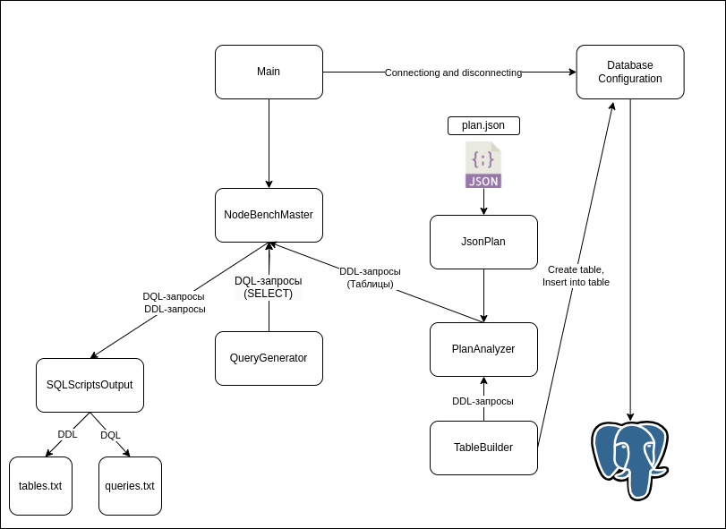

# pg_nodebench

#### pg_nodebench -- это приложение, генерирующее запросы с заданным планом выполнения.
Все допустимые планы выполнения находятся в папке _testplans_.
Запросы генерируются случайным образом (случайный выбор столбцов из таблиц,
случайный выбор селективности условий).



**Database Configuation** -- компонент отвечающий за соединение
с базой данных PostgreSQL. 

**NodeBenchMaster** -- основной класс, который управляет компонентами.

**JsonPlan** -- стуруктра JSON с планом запроса.

**PlanAnalyzer** -- компонент, отвечающий за создание таблиц, 
необходимых для генерации запросов и создает структуру 
**NodeTree**. Возвращает DDL-запросы, 
(создание таблиц и вставка) и
**NodeTree**.

**NodeTree** -- структура дерева плана запроса
состоящий из узлов Node. 

**Node** -- объекты данного интерфейсы, представляют собой узлы
дерева плана. Строит запрос с помощью метода 
buildQuery(QueryBuilder).

**Scan** -- объекты данного интерфейса, представляют собой узлы
чтения таблицы. Генерируют таблицу, 
для которой можно выполнить опреденный тип чтения.

**TableBuilder** -- компонент, который строит таблицы 
и вставляет в них данные. Возвращает DDL-запросы, 
(создание таблиц и вставка)

**QueryGenerator** -- компонент, отвечающий за генерацию запросов.
Принимает в аргументы NodeTree, и в зависимости от узлов дерева NodeTree 
строит запрос.

**QueryBuilder** -- класс, который отвечает за создание запроса.
Объект этого класса обходит дерево NodeTree и меняет свои свойства
после обхода узла Node. 
После обхода с помощью метода build() строится
запрос.

**SQLScriptsOutput** -- компонент, который отвечает за 
вывод реузльтирующих sql-запросов(ddl-запросы для таблиц и 
dql-запросы с заданным планом).

**tables.txt** -- файл с таблицами.

**queries.txt** -- файл с запросами.

**bench.log** -- лог.

### Реализованные узлы:

Узлы чтения:
> Seq Scan
> 
> Index Scan
> 
> Index Only Scan
> 
> Bitmap Index Scan
> 
> Bitmap Heap Scan

Функциональные узлы:

> Aggregate
> Append

Узлы соединения:

> Nested Loop
> 
> Hash Join
> 
> Merge Join

Вспомогательные узлы:

> Hash
> 
> Materialize

### Build

``` 
./gradlew
```

### Run
```
java -jar build/libs/pg_nodebench-1.0.jar -h localhost -j testplans/mergejoin.json -S 1000 -q 50
```

-h -- хост.

-j -- путь к json-файлу.

-S -- размер таблиц в строках (всех).

-q -- количество запросов. По умолчанию 100.

-d -- имя базы данных. По умолчанию 'postgres'

-U -- имя пользователя.

-p -- порт. По умолчанию 5432.

-P -- пароль пользователя.


